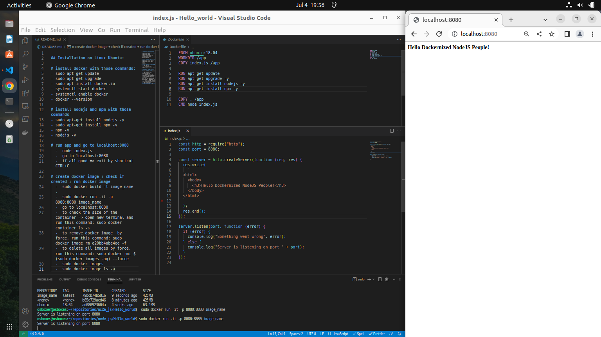

## Installation on Linux Ubuntu:

# install docker with those commands:
- sudo apt-get update
- sudo apt-get upgrade
- sudo apt install docker.io
- systemctl start docker
- systemctl enable docker
- docker --version

# install nodejs and npm with those commands
- sudo apt-get install nodejs -y
- sudo apt-get install npm -y
- npm -v
- nodejs -v

# run app and go to localhost:8080
  -  node index.js
  -  go to localhost:8080
  -  if all good => exit by shortcut CTRL+C

# create docker image + check if created + run docker image
  -  sudo docker build -t image_name .
  -  sudo docker run -it -p 8080:8080 image_name
  -  go to localhost:8080
  -  to check the size of the container => open new terminal and run this command: sudo docker container ls -s
  -  to remove docker image  by force, run this command: sudo docker image rm e20bb4abe4ee -f
  -  to delete all images by force, run this command: sudo docker rmi $(sudo docker images -aq) --force
  -  sudo docker images
  -  sudo docker image ls -a